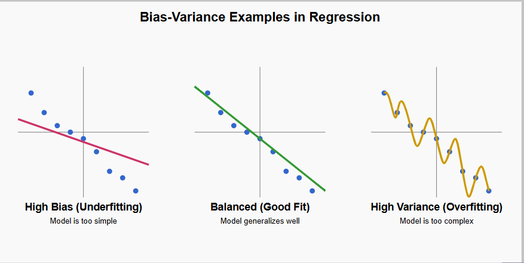
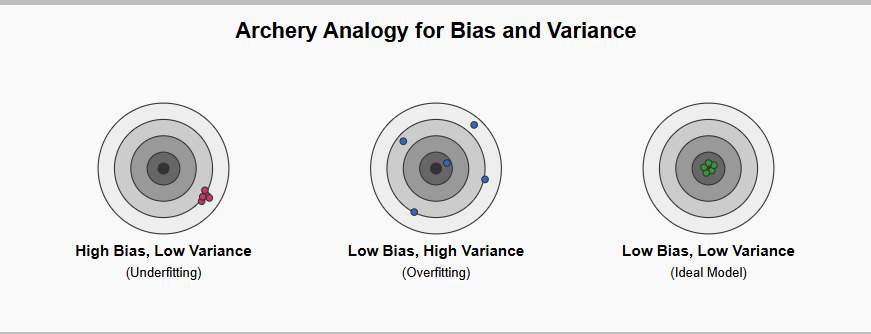

## 1. Bias
When a model is too simple and misses important pattersn, leading to poor accuracy. [Underfitting]    

## 2. Variance 
When a model is too complex and learns random noise, making it performing well on training data but poorly on new data. [Overfitting]

---

# Understanding the Bias-Variance Tradeoff: A Narrative for All Learners

---

## Chapter 1: Learning Like a Student

Imagine you're a student learning math by practicing different types of problems. Some students develop a deep understanding, while others struggle. Interestingly, machine learning models behave a lot like these students.

Let’s look at a few learning styles:

### Bias – The Overconfident Guesser  
This student relies heavily on assumptions. They ignore the details of the question and stick to fixed rules.  
For example, they think, “Area? That’s always just length times width.”  
But if the problem changes format—say, includes variables or comes in a word problem—they get it wrong.

In machine learning, this is similar to a high-bias model. A simple model like linear regression assumes the world is straightforward. It often misses important patterns, which leads to **underfitting**.

---

### Variance – The Over-Memorizer  
This student memorizes every problem word-for-word, including specific numbers, but doesn't truly understand the logic behind it.  
For example, they remember that one problem had a length of 5 and width of 3, so they assume the answer must be 15, even when the numbers change.

In machine learning, a high-variance model behaves this way. It memorizes training data—including noise or irrelevant details—and performs poorly on new, unseen data. This is known as **overfitting**.

---

### Balanced Learner  
The ideal student understands the underlying concepts. They know what the area formula means, how to apply it, and how to adapt it to new situations. Whether the question is presented differently or uses new numbers, they can solve it accurately.

This is what we want from a machine learning model: low bias, low variance, and the ability to **generalize** to new data.

---

## Chapter 2: Defining Bias and Variance

Here’s a simplified comparison using the student analogy:

| Term             | Like a Student Who...                                                           |
|------------------|----------------------------------------------------------------------------------|
| High Bias        | Ignores details and relies on fixed assumptions                                 |
| High Variance    | Memorizes everything and overreacts to changes                                  |
| Low Bias         | Understands the big picture without oversimplifying                             |
| Low Variance     | Is consistent, reliable, and not easily thrown off by new formats               |

---

## Chapter 3: The ML Engineer's Perspective

From the technical side, every machine learning model comes with a set of assumptions. These assumptions are built into the structure of the model itself.

### Why Do Models Have Assumptions?

Because learning from data requires structure. Without assumptions, a model can't generalize from limited data. In essence, assumptions help the model learn something useful from incomplete information.

### What Are These Assumptions?

Here are a few common examples:

| Model Type          | Typical Assumptions                                      |
|---------------------|----------------------------------------------------------|
| Linear Regression    | The relationship between inputs and outputs is linear   |
| Decision Trees       | Data can be split using clear decision rules            |
| Naive Bayes          | Features are conditionally independent                  |
| K-Nearest Neighbors  | Similar data points exist close to each other           |
| Neural Networks      | Complex patterns can be learned from layered structures |

These assumptions may not always match reality perfectly, but they allow learning to happen efficiently.

---

## Chapter 4: Who Decides These Assumptions?

There are two groups involved:

1. **Model Designers (Researchers and Mathematicians):**  
   These are the people who create the algorithms. They decide how a model learns by defining its mathematical structure.

2. **You, the ML Practitioner:**  
   When you choose which model to use, you're also choosing which set of assumptions you're comfortable with for your specific data and task.

For example, if your data is noisy and nonlinear, using a linear regression model might not be appropriate because its assumptions don’t fit the problem.

---

## Chapter 5: The Balance Between Bias and Variance

In real-world machine learning, bias and variance are always present. You cannot eliminate one without affecting the other.

Trying to reduce bias often increases variance. Trying to reduce variance can increase bias. This balancing act is one of the core challenges of building good machine learning models.

### A Visual Analogy: Archery

Imagine shooting arrows at a target:

| Pattern of Arrows               | Bias       | Variance   | Interpretation                         |
|----------------------------------|------------|------------|----------------------------------------|
| All arrows off-center, tightly grouped | High       | Low        | The model is too simple (underfitting) |
| Arrows scattered all over               | Low        | High       | The model is too complex (overfitting) |
| Arrows near center, tightly grouped     | Low        | Low        | The model generalizes well             |

---

## Chapter 6: Real-World Takeaways

The key to building a good model is to manage the bias-variance tradeoff effectively.

- A high-bias model might be too simple to capture the important patterns.
- A high-variance model might be too sensitive to small fluctuations in the data.
- A balanced model finds the “just right” spot, learning the essential patterns and ignoring the noise.

---

## Final Recap: From Students to Machine Learning Models

| Scenario                                | Student Analogy                                      | Machine Learning Model                 |
|-----------------------------------------|------------------------------------------------------|----------------------------------------|
| High Bias                               | Guesses using shortcuts, fails new question types    | Oversimplifies, misses key patterns    |
| High Variance                           | Memorizes data, fails when questions change          | Overfits to training data              |
| Balanced Bias and Variance              | Understands concepts, adapts well to new problems    | Learns patterns and generalizes well   |
| Low Bias + Low Variance (Ideal Model)   | Experienced learner who is flexible and consistent   | Accurate and robust across scenarios   |

---

## Closing Thoughts

Whether you're a student preparing for an exam or an engineer building a predictive model, the bias-variance tradeoff is about one thing: learning to generalize. A good model — like a good student — doesn't memorize or oversimplify. It understands patterns, adapts intelligently, and performs well when the questions change.
